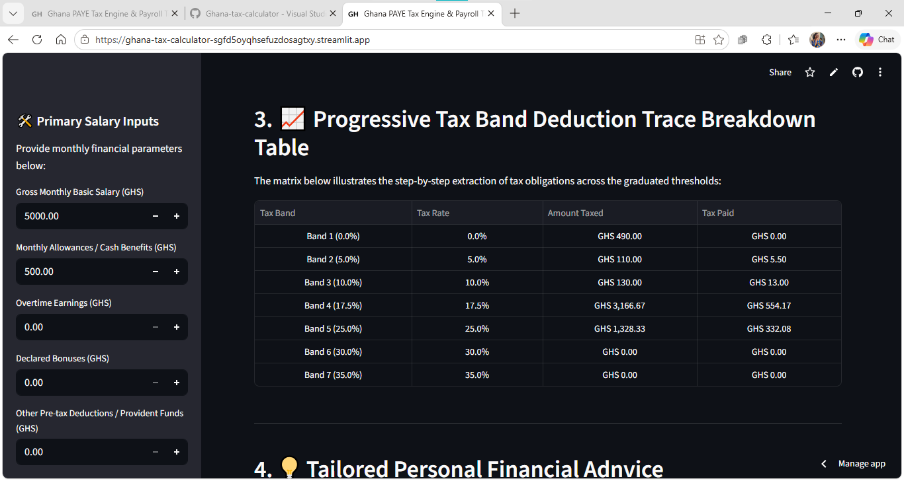
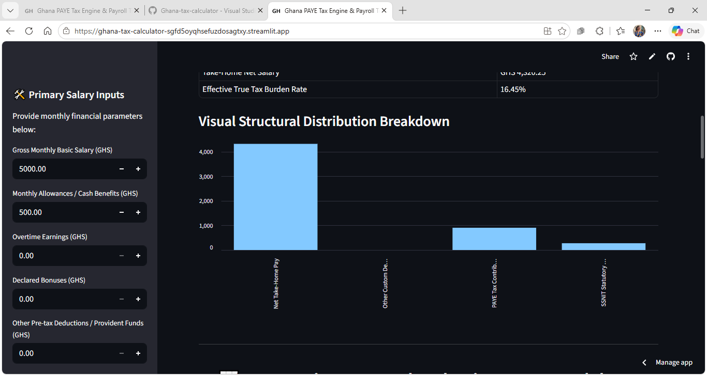
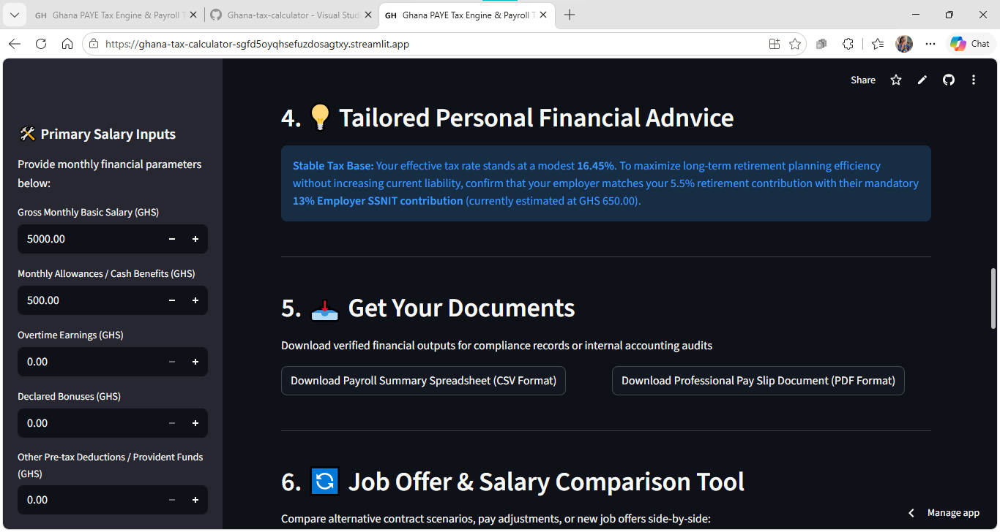

## 🚀 Production Operation & Deployment Guide

Follow these steps to operate the calculator engine locally or push it to a live cloud server.

### 1. Running the Application Locally
After installing your dependencies from the `requirements.txt` file, boot up the local web engine:
```bash
streamlit run App.py
```
* **Note**: A local browser window should pop up automatically at `http://localhost:8501`. If it does not, copy the link outputted in your terminal.

---

### 2. How to Operate the Application Interface

#### 📊 Salary Tax Calculator Tab
1. **Input Parameters**: Use the sidebar or input fields to specify a worker's **Monthly Basic Salary**, **Allowances**, **Bonus**, and **Overtime**.
2. **Review Deductions**: Watch the **Payroll Transparency Dashboard** update live. It automatically isolates the 5.5% SSNIT worker deduction before running the multi-bracket tax algorithm.
3. **Audit the Breakdown Table**: Verify compliance using the required **Tax Band | Tax Rate | Amount Taxed | Tax Paid** matrix display.
4. **Export Audits**: Click the **📥 Download Payroll Breakdown Report (.CSV)** button at the bottom of the page to export local records instantly.

#### 📈 Multi-Salary Comparison Tool Tab
1. Input two unique base compensation figures under Profile Option A and Option B.
2. Review the structural visual bar chart comparing respective effective tax burdens side-by-side.

---

### 3. Cloud Deployment Instructions (Streamlit Community Cloud)
To fulfill the public deployment requirement, follow these continuous integration steps:

1. Visit [share.streamlit.io](https://streamlit.io) and log in using your GitHub Account.
2. Click **New App** in the upper-right corner of your workspace dashboard.
3. Configure the deployment properties field precisely as follows:
   * **Repository**: `mawunyo-creator/Ghana-tax-calculators`
   * **Branch**: `main` (Ensure you have merged your `development` branch into `main` before this step)
   * **Main file path**: `App.py`
4. Click **Deploy!** Your production build will be live globally on a public web URL within 2 minutes.

## 💾 Application Previews

### Progressive Tax Band Calculations


### Responsive Analytics Visualizations

### 2. GRA Progressive Tax Table Allocation

### 3. Tailored Financial Advice & Document Export Capabilities

## 💾 Complete Application Previews

### 1. Main Payroll Metrics Dashboard


### 2. GRA Progressive Tax Table Allocation Tiers


### 3. Automated Advice Columns & Data Export Utilities

## 📺 Project Walkthrough Demonstration

Click the link below to watch the full system simulation and calculation walkthrough:

👉 [Watch the Project 1 Demo Video](https://drive.google.com/file/d/1OJwUsp7wiD_Txc5ZBPvUE9WWEoxeXAHA/view?usp=sharing

)---

## ⚖️ Source Transparency & Free-Tier Documentation

* [cite_start]**Official Data Source:** Ghana Revenue Authority (GRA) PAYE Official Tax Structure[cite: 343].
* [cite_start]**Data Access Date:** Accessed May 2026 (Built into localized static JSON matrix to prevent prohibited live web scraping)[cite: 345, 346].
* [cite_start]**Hosting Platform Free-Tier Limits:** Deployed via Streamlit Community Cloud Free Tier[cite: 300]. [cite_start]Application resources are limited to standard container memory limits; containers may enter a temporary sleep state during prolonged inactivity[cite: 302].
* [cite_start]**Data Persistence Disclaimer:** All calculated values are processed locally in volatile memory; permanent database persistence is not required for this local prototype[cite: 306].